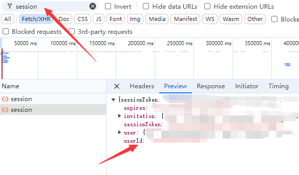

# follow-checkin

## 参数获取方法[点击登录](https://app.follow.is/)
1. `USER_ID`获取方法 控制台搜索`session`

2. `COOKIE`也可以从`session`请求头`cookie`直接复制使用
```
authjs.csrf-token=...
```
## `follow.sh`使用方法
修改脚本内`COOKIE`、`USER_ID`变量值
给脚本执行权限
```
chmod +x follow.sh
```
添加定时任务
```
crontab -e
# sh脚本用这个
0 8 * * * /path/to/follow.sh >> /path/to/logfile.log 2>&1
# py脚本用这个
0 8 * * * /usr/bin/python3 /path/to/follow.py >> /path/to/logfile.log 2>&1
# nodejs用这个
0 8 * * * /usr/bin/node /path/to/follow.js >> /path/to/logfile.log 2>&1
```
> `/usr/bin/python3` 是 `Python 3` 的路径，`/path/to/follow.(sh | py)` 是你存放 `sh | Python` 脚本的路径。输出将记录到 `logfile.log` 中
## 使用`follow.js`需要安装`axios`
```
npm install axios
```
## 不知道`/usr/bin/xxx`怎么获取的试试执行
```
which python3
which node
```